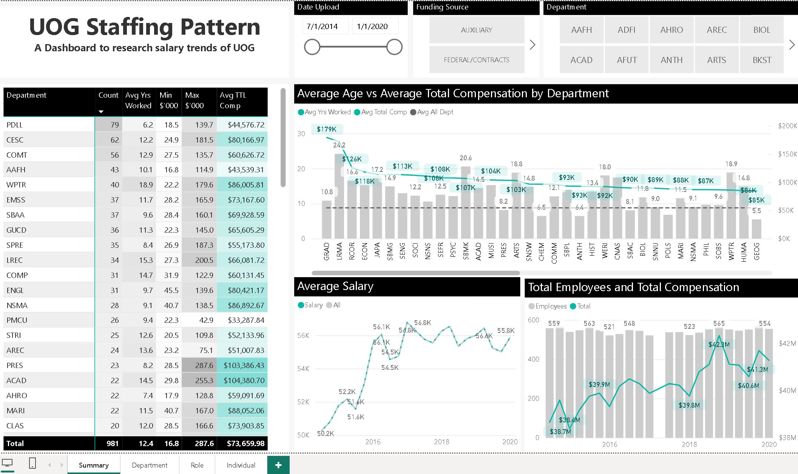

# PublicStaffingPatternsGU

## Purpose
The goal of this project is to visualize University of Guam salary trends for research and analysis.
This dashboard was built for BA-610 Managerial Economics.

## Outcome
The findings of the project presented evidence toward wage stagnation vs inflation with an outdated pay scale that resulted in salary inversions where new-hires are recruited at the tail end of a pay scale, limiting their future salary progression which contributed toward lower faculty retention.

The project was presented to UOG Faculty Union Head, Dr. Roseann Jones, which contributed toward successful negotiations for a 22% pay increase and a restructuring of the existing pay scale.
https://www.guampdn.com/news/uog-board-approves-22-salary-raises-for-classified-workers/article_2584304c-5e90-11ee-b603-1b546ab5cd0f.html

## Approach
1. A Python script was used to parse salary data from public staffing patterns PDF files to convert to Excel.
2. This Excel data was used to ingest into a Power BI dashboard for visualizations presented in our project report.

## Done
- University of Guam (2014-2020)

## Future Improvements 
- Include data from other universities within the US nation
- Add data about economic trends such as inflation rate and consumer price index (CPI)
- Include data from other public organizations within Guam
- Revise dashboard design to more generalized headings to accomodate other public organizations

## Sources
University of Guam Staffing Pattern: https://www.uog.edu/administration/administration-finance/human-resources/staffing-pattern.php
